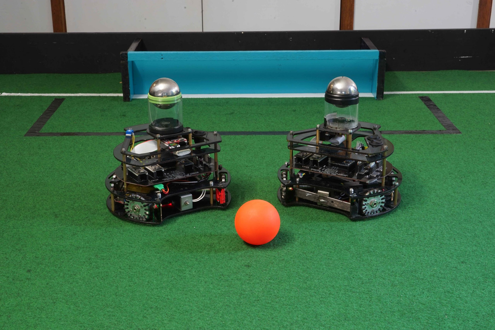

---

### National Organization for Development of Exceptional Talents (NODET)

This was our high school project at [NODET](https://en.wikipedia.org/wiki/National_Organization_for_Development_of_Exceptional_Talents), the Iranian national organization for gifted students. The goal was to build a team of small autonomous robots that could play soccer: chasing a ball, positioning, attacking, and defending, all on their own.

It turned out to be a collection of firsts.

*Photo: [RoboCup Junior Soccer](https://www.robocupjunior.org.au/soccer/)*

### The robots

The soccer ball had **IR emitters** inside, and the robots tracked it using **infrared receivers** mounted around the chassis. **Ultrasonic sensors** took care of obstacle detection and distance to walls and other robots.

Everything ran on an **ATMEGA32 microcontroller**, an 8-bit AVR chip. We designed the **PCB from scratch**, which mostly meant learning what not to do by doing it wrong first and then fixing it.

### The software

Our first time writing **C** for anything real. The code handled:

- Reading IR sensor arrays to figure out where the ball was
- Reading ultrasonic sensors for proximity
- A **positioning controller** to keep the robot near the center of the field
- Simple logic to switch between **attack** (ball ahead) and **defence** (ball behind or near own goal)

No libraries, no OS, just registers and loops. Frustrating and fun in equal measure.

### Looking back

The controller we wrote was basically a state machine with a bunch of if-statements. Not so different, conceptually, from what I now study as dynamical systems and control theory. At the time we just wanted the robots to score a goal.

Also worth mentioning: most of the friends from that robotics lab are still some of my closest friends today. Good projects have a way of doing that.

---

*High school project, NODET, Iran, 2012–2014.*
