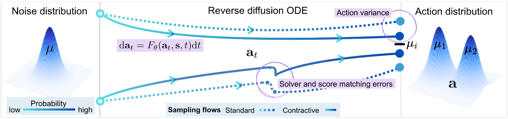
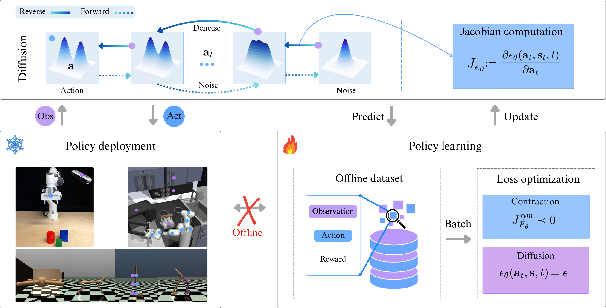
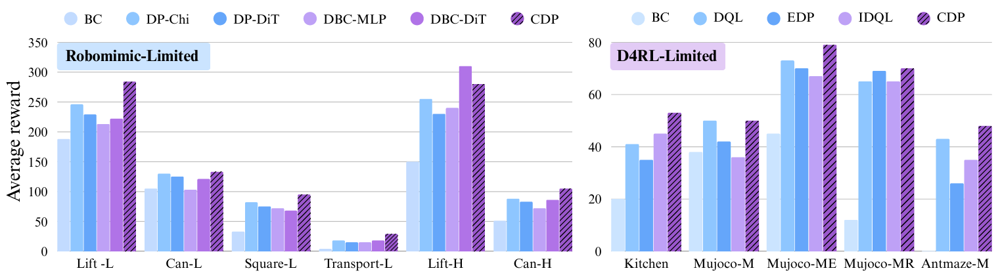
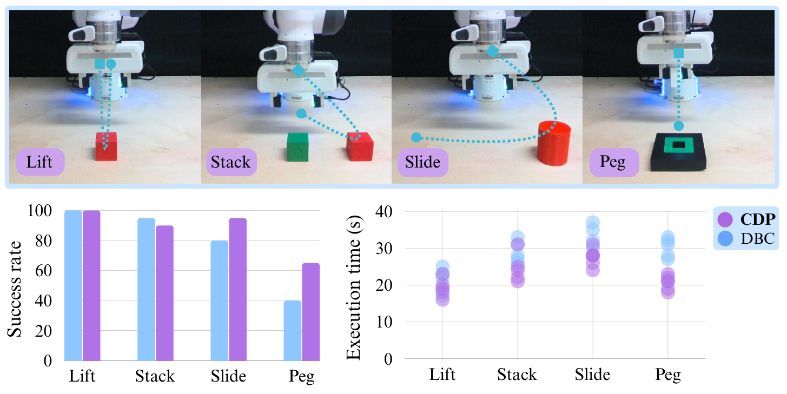

---

### Links

+ [Paper](https://openreview.net/pdf?id=iKJbmx1iuQ)
+ [Project page](https://contractive-diffusion.github.io)

---


### Why not normal diffusion? 

Diffusion policies have emerged as powerful generative models for offline policy learning, where a learned score function guides a stochastic differential equation (SDE) to iteratively denoise actions. But the same score-based SDE modeling that enables diverse behavior suffers from solver and score-matching errors and inconsistencies in action generation. These inaccuracies might be tolerable in image generation, but they accumulate in continuous control and can drive the policy off the dataset support, harming performance and safety, especially on real robots.



### What do we do? 

In Contractive Diffusion Policies (CDPs), we address this by explicitly promoting **contraction** in the diffusion sampling dynamics. Contraction pulls nearby SDE/ODE flows closer together, enhancing robustness to solver and score-matching errors while reducing unwanted action variance. We provide a theoretical analysis linking contraction to reduced error accumulation in diffusion sampling, and derive a practical implementation recipe that augments existing diffusion policy architectures with a single tuned hyperparameter and an efficient contraction loss. 

> CDPs integrate with standard offline RL and imitation-learning backbones with minimal modification and computational overhead.




## Experiments

We evaluate CDPs extensively on continuous-control benchmarks (including D4RL and RoboMimic) and real-world robotic manipulation tasks. Across settings, CDPs often outperform non-contractive diffusion policies, with particularly strong gains in low-data regimes, supporting the view that contraction helps mitigate error accumulation in diffusion-based policy learning.



And in real world experiments, CDP perform better for tasks that require higher precision. 



---


### Citation

"Contractive Diffusion Policies: Robust Action Diffusion via Contractive Score-Based Sampling with Differential Equations." ICLR 2026, under review.

```latex
@article{contractive_diffusion_policies_2025,
  title   = {Contractive Diffusion Policies: Robust Action Diffusion via Contractive Score-Based Sampling with Differential Equations},
  author  = {Anonymous},
  year    = {2025},
  note    = {ICLR 2026 Conference Submission},
  url     = {https://openreview.net/forum?id=iKJbmx1iuQ}
}
```