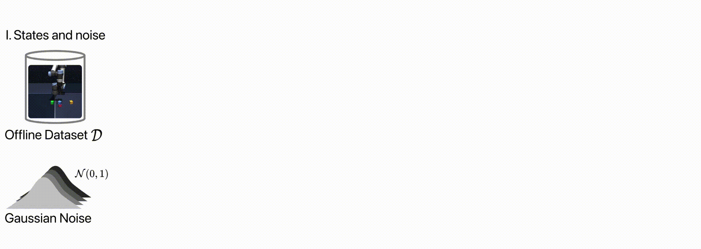
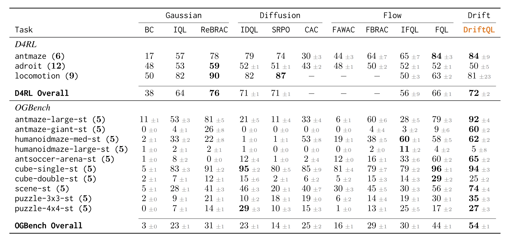
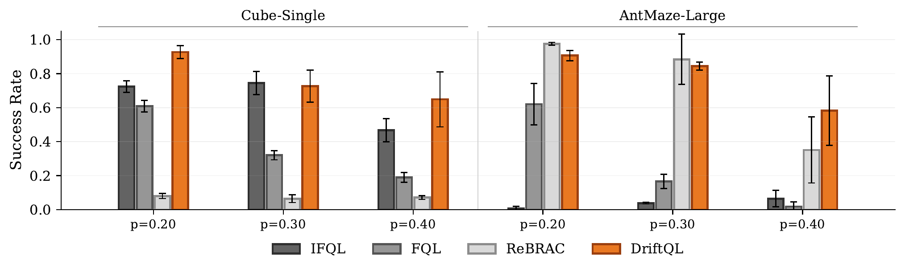

---

### Links

+ [arXiv](https://arxiv.org/abs/2606.00350)
+ [Paper](https://arxiv.org/pdf/2606.00350)
+ [Project page](https://driftql.github.io)

---

### The core tension in offline RL

The whole problem with offline RL is that you only have a fixed dataset. If your policy tries an action nobody ever took, there's no feedback telling you whether it's a good idea. Most methods deal with this through pessimism, stay close to what the data supports. The expensive part is *how* they do it. Diffusion and flow-based approaches work well but require iterative denoising or an ODE solver at every step, which adds latency and complexity.


### The drift idea

DriftQL sidesteps the denoising chain entirely. Instead of learning to generate actions through iterative refinement, it learns a **drift field** that shapes where candidate actions land in a single pass.

The field has two components working in tension. **Attraction** pulls candidates toward actions that actually appear in the dataset, keeping them on safe ground. **Repulsion** pushes candidates away from each other, so you get coverage rather than collapse. The critic then scores the candidates and tilts the gradient toward whichever ones look most promising.



One network, one loss, one forward pass. No solver, no distillation trick to make it fast at test time, it's just fast.

### Results

DriftQL holds up well across OGBench and D4RL, matching or beating diffusion and flow-based methods without the inference overhead.



It also handles corrupted data better than you might expect, which matters in practice since real datasets are rarely clean.



---

### Thanks

Thanks to Mohamad and Anas, close friends and colleagues who do not quit until the task is done. Thanks to Scott Fujimoto who helped us shape a naive idea into a strong submission, and to Hsiu-Chin Lin and Dave Meger for their guidance throughout.

---

### Citation

```latex
@article{driftql2026,
  author    = {Houssaini, Anas and Danesh, Mohamad H. and Abyaneh, Amin and Fujimoto, Scott and Lin, Hsiu-Chin and Meger, David},
  title     = {Drift Q-Learning},
  journal   = {Preprint},
  year      = {2026},
}
```
