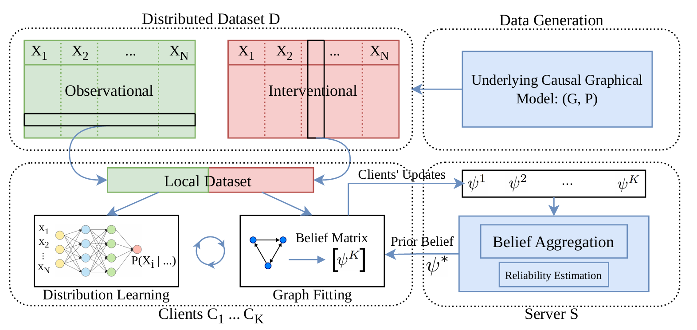

---

### Links

+ [Paper](https://arxiv.org/pdf/2211.03846)
+ [arXiv](https://arxiv.org/abs/2211.03846)
+ [Code](https://github.com/aminabyaneh/fed-cdi)

---

> **New to causal inference?** The Microsoft Data Science team has a great accessible overview of causal inference, experimentation, and causal discovery. Worth a read before diving into the paper: [Causal Analysis Overview](https://medium.com/data-science-at-microsoft/causal-analysis-overview-causal-inference-versus-experimentation-versus-causal-discovery-d7c4ca99e3e4)

---

### A summer at Max Planck, Tübingen

This project came out of a research visit to the [Max Planck Institute for Intelligent Systems](https://is.mpg.de/) in Tübingen, Germany. Working with the group of [Bernhard Schölkopf](https://is.mpg.de/person/bs) and closely with [Arash Mehrjou](https://amehrjou.github.io/) was a lot of fun and genuinely formative.

The people at Max Planck were warm and welcoming, and Tübingen itself is a wonderful little university town on the Neckar river. Quiet, focused, good food. Highly recommend.

### The problem

Causal discovery is about recovering cause-and-effect relationships between variables from data. Usually you collect everything in one place and run an algorithm. But what if the data cannot move? Privacy laws, institutional policies, or just practical scale mean that in many real settings, data stays local.

Federated learning addresses this for predictive models, but causal discovery is harder. You are not just fitting a function, you are trying to recover a graph, and the useful signal for that often comes from *interventional* data, where some variable is deliberately manipulated. Pooling that signal across sites without sharing raw data is the core challenge.

### Our approach: FedCDI

We introduce **FedCDI**, where clients keep their data locally and share only *belief updates* over possible causal graphs with a central aggregator. The aggregator combines these and sends back a refined global belief, which each client uses to sharpen its local estimate.

This works even when sites intervene on different variables, which is the common case in practice:

- **Shared interventions:** multiple sites targeting the same variable, combining their signal
- **Heterogeneous interventions:** sites with different targets, each contributing something the others cannot see

No raw data ever leaves a client.



### Results

FedCDI recovers causal structure competitively with centralized baselines, and well above what any single site could do alone. The gains are sharpest when individual sites have limited data, which is exactly the setting where federation matters most.

### The cursed paper

We submitted this work multiple times. The last two rounds, every reviewer came back positive, and it still did not make it through. At some point you just laugh about it and move on. The work is public, the code is out there, and others have picked it up. That is more than enough.

### Citation

```latex
@article{abyaneh2022federated,
  title={Federated Causal Discovery From Interventions},
  author={Abyaneh, Amin and Scherrer, Nino and Schwab, Patrick and Bauer, Stefan and Sch{\"o}lkopf, Bernhard and Mehrjou, Arash},
  journal={arXiv preprint arXiv:2211.03846},
  year={2022}
}
```
