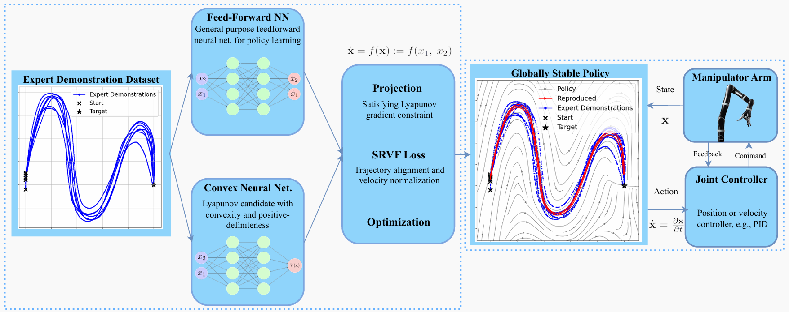
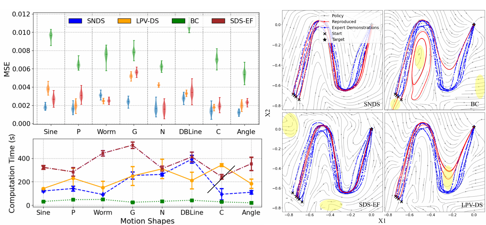

---

### Links

+ [Paper](https://arxiv.org/pdf/2403.04118)
+ [arXiv](https://arxiv.org/abs/2403.04118)

---

### The problem

Imitation learning policies learn from expert demonstrations but tend to fail unpredictably when the robot drifts into unexplored regions of the state space. Without formal stability guarantees, there is no assurance the robot will recover gracefully, which is a real safety concern for deployment.

### Method

We introduce the **Stable Neural Dynamical System (SNDS)**, a neural architecture that jointly trains a policy network with a corresponding Lyapunov candidate function. This joint training enforces global stability by construction: the policy is guaranteed to converge to the target state from anywhere in the state space, not just near the training trajectories.



The figure above illustrates the SNDS architecture: the neural policy and Lyapunov candidate are trained together, with the Lyapunov conditions enforced as soft constraints during learning. This avoids the computational overhead of explicit feasibility checks while still providing formal guarantees.

### Results

SNDS outperforms prior imitation learning methods in terms of stability, accuracy, and computational efficiency. The results below summarize performance across multiple trajectory learning benchmarks.



We validate both in simulation and in real-world experiments using the **Kinova Jaco2** robotic arm. As a fun side note, Kinova is a Montreal-based robotics company, which felt like a fitting choice for a project coming out of McGill and Mila.

### Conference

This work was published at the **2024 IEEE International Conference on Robotics and Automation (ICRA)**, Yokohama, Japan, pp. 15061–15067.

### Citation

```latex
@inproceedings{abyaneh2024globally,
  title={Globally Stable Neural Imitation Policies},
  author={Abyaneh, Amin and Sosa Guzm{\'a}n, Mariana and Lin, Hsiu-Chin},
  booktitle={2024 IEEE International Conference on Robotics and Automation (ICRA)},
  pages={15061--15067},
  year={2024}
}
```
