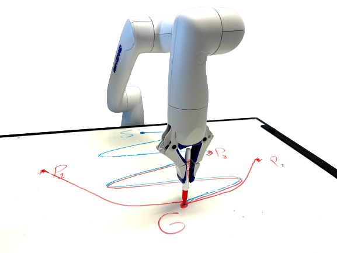
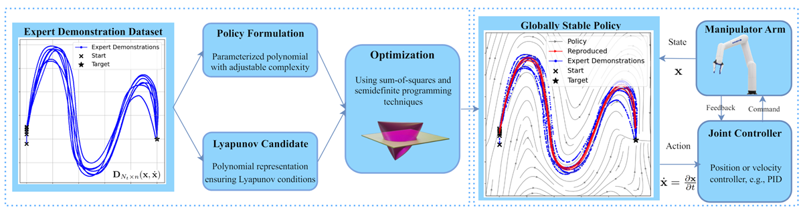
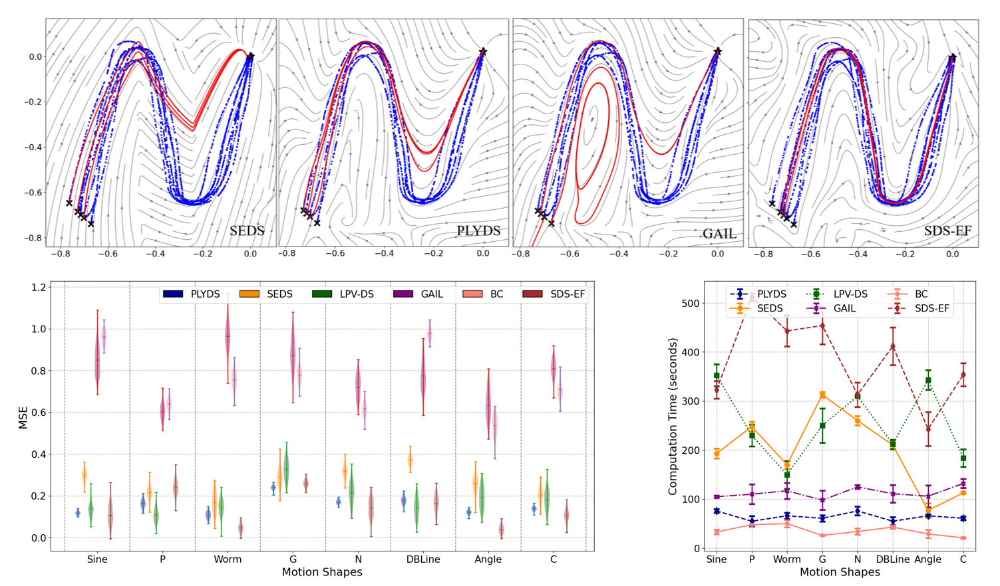

---

### Links

+ [Paper](https://openreview.net/pdf?id=lILEtkWOXD)
+ [Project page](https://sites.google.com/view/contractive-dynamical-policies)
+ [Slides](https://gamma.app/docs/Contractive-Dynamical-Imitation-Policies-for-Efficient-Out-of-Sam-lvmoigk6846tu9a)

---

### Missing my first conference

Unfortunately, I couldn't attend my first conference paper presentation at CoRL'23 due to US visa processing delays. I applied for a visa well in advance, but faced significant backlog issues that persisted beyond the conference date. As of then (several months after submission), I was still awaiting visa approval, which had been pending since October 2023.

### The approach

Most imitation learning methods learn to copy expert trajectories, but have no guarantees about what happens when the robot drifts off the demonstrated path. That's a real problem in practice. Earlier work used stable dynamical systems to at least guarantee convergence back to the goal, but those methods tend to struggle with accuracy on complex, highly nonlinear trajectories, or come with significant computational cost.

<div style="display: flex; justify-content: center; margin: 24px 0;">
  
</div>

PLYDS takes a different angle: instead of a neural network, we represent the policy as a **parametric polynomial** and learn its coefficients jointly with a Lyapunov candidate. No neural network, no black box. The result is a fully interpretable, globally stable motion planner. This keeps things analytically tractable and works particularly well for **low-dimensional, high-precision tasks** where you need the robot to follow a trajectory accurately and recover cleanly from perturbations.

### Design overview

The polynomial structure gives PLYDS tunable complexity. A higher-degree polynomial can capture more complex expert trajectories, while keeping the Lyapunov conditions tractable through semi-definite programming.



### Results

Despite the simplicity of the formulation, PLYDS holds up well against neural baselines on 2D motion planning tasks, with strong sample efficiency and accurate trajectory reproduction.



### Conference

This work was published at the **Conference on Robot Learning (CoRL)** 2023.

### Citation

```latex
@inproceedings{abyaneh2023learning,
  title={Learning Lyapunov-Stable Polynomial Dynamical Systems Through Imitation},
  author={Abyaneh, Amin and Lin, Hsiu-Chin},
  booktitle={7th Annual Conference on Robot Learning},
  year={2023}
}
```
