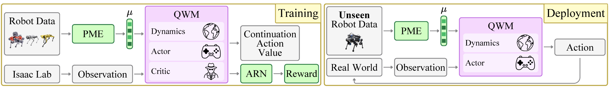

---

### Links

+ [arXiv](https://arxiv.org/abs/2604.08780)
+ [Paper](https://arxiv.org/pdf/2604.08780)
+ [Project page](https://modanesh.github.io/papers/qwm/)

---

### The problem

World models are powerful but brittle. A model trained on one quadruped fails on another the moment the leg lengths, actuator specs, or mass distribution shift. Every new robot means a new model, which defeats the point of having a learned world model at all.

### QWM

QWM extends DreamerV3 with explicit morphology conditioning so the same model can reason about multiple robots at once. Three additions do the work:

- A **Physical Morphology Encoder** that turns kinematic, geometric, and actuation specs into a compact embedding
- **Morphology-conditioned recurrent dynamics** that inject this embedding at each step so predictions are robot-aware
- An **Adaptive Reward Normalizer** to handle the different reward scales that come with heterogeneous hardware



Training runs across eight distinct quadrupeds in parallel using Hetero-Isaac, a custom extension of NVIDIA Isaac Lab built for this purpose.

### Results

A single QWM generalizes zero-shot to Unitree Go1 and ANYmal-D, both held out during training, with zero falls across 20 trials and no fine-tuning. It outperforms DreamerV3, PWM, and TWISTER on the full heterogeneous robot cohort.


---

### Citation

```latex
@article{danesh2026qwm,
  author    = {Danesh, Mohamad H. and Li, Chenhao and Abyaneh, Amin and Houssaini, Anas and Ellis, Kirsty and Berseth, Glen and Hutter, Marco and Lin, Hsiu-Chin},
  title     = {Toward Hardware-Agnostic Quadrupedal World Models via Morphology Conditioning},
  journal   = {Preprint},
  year      = {2026},
}
```
