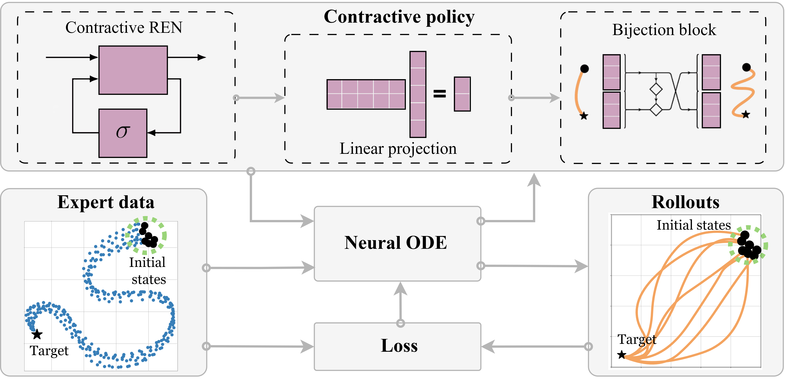

---

### Links

+ [Paper](https://openreview.net/pdf?id=lILEtkWOXD)
+ [Project page](https://sites.google.com/view/contractive-dynamical-policies)
+ [Slides](https://gamma.app/docs/Contractive-Dynamical-Imitation-Policies-for-Efficient-Out-of-Sam-lvmoigk6846tu9a)

---

### A summer at NCCR and EPFL

This work came out of a research visit to EPFL, supported by [NCCR's Visiting Researcher's Fellowship](https://nccr-automation.ch/research-fellowship). Working closely with [Mahrokh G. Boroujeni](https://people.epfl.ch/mahrokh.ghoddousiboroujeni?lang=en) and Prof. [Giancarlo Ferrari-Trecate](https://www.epfl.ch/labs/decode/) at EPFL's Laboratoire d'Automatique was a genuine pleasure. Mahrokh and I contributed equally to everything here.

<div style="display: flex; justify-content: center; margin: 24px 0;">
  
</div>

### When the robot drifts off track

Imitation learning works by having the robot copy expert demonstrations. It tends to do well near trajectories it has seen before, but real robots get bumped, slip, and drift. When that happens, most policies have no way to reason about recovery. They might converge back eventually, or they might not.

Earlier work addressed this with stable dynamical systems, which at least guarantee eventual convergence to a goal. But stability says nothing about what happens on the way back: how fast, how smoothly, or whether the path taken is even reasonable. That gap matters when you care about real execution.

### Contractivity: a stronger handle on behavior

We model the policy as a **contractive dynamical system**. Contraction is a stronger property than stability: instead of just saying trajectories end up at the same place, it says they actively pull toward each other throughout the motion. Two rollouts starting from different initial conditions will converge, and we can say how fast.

This gives us certificates on both convergence and transient behavior, not just the endpoint.

The policy is built from three pieces that compose cleanly:

- **REN module:** a recurrent equilibrium network that is contractive by construction, for any parameter values
- **Linear transformation:** adjusts the dimensionality of the latent space
- **Bijection block:** adds expressive power without breaking the contraction property

Because the architecture handles contractivity automatically, training is plain unconstrained optimization. No projection steps, no Lyapunov feasibility checks, no constrained solver.



> We also derive upper bounds on worst-case and expected imitation loss, connecting the empirical results to formal guarantees.

### Results

SCDS policies are trained on expert demonstrations and deployed directly with a low-level controller. The contraction guarantee means recovery from perturbations is reliable across all tested scenarios.


We tested on manipulation and navigation tasks using a Franka Panda arm and a Clearpath Jackal robot in Isaac Lab, and the approach holds up in both settings.


---

### Peer review

Curious about the review process? The full discussion is public on [**OpenReview**](https://openreview.net/forum?id=lILEtkWOXD&referrer=%5BAuthor%20Console%5D(%2Fgroup%3Fid%3DICLR.cc%2F2025%2FConference%2FAuthors%23your-submissions)).

### What is ICLR?
ICLR is the premier venue for research on representation learning and deep learning. [**Check out their website!**](https://iclr.cc/)

### Citation

`* equal contribution`

```latex
@inproceedings{abyaneh2025contractive,
title={Contractive Dynamical Imitation Policies for Efficient Out-of-Sample Recovery},
author={Amin Abyaneh and Mahrokh Ghoddousi Boroujeni and Hsiu-Chin Lin and Giancarlo Ferrari-Trecate},
booktitle={The Thirteenth International Conference on Learning Representations},
year={2025},
url={https://openreview.net/forum?id=lILEtkWOXD}
}
```
