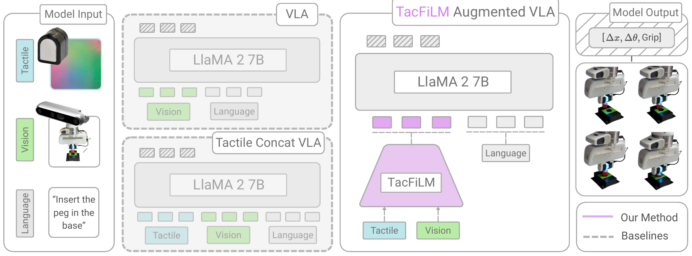
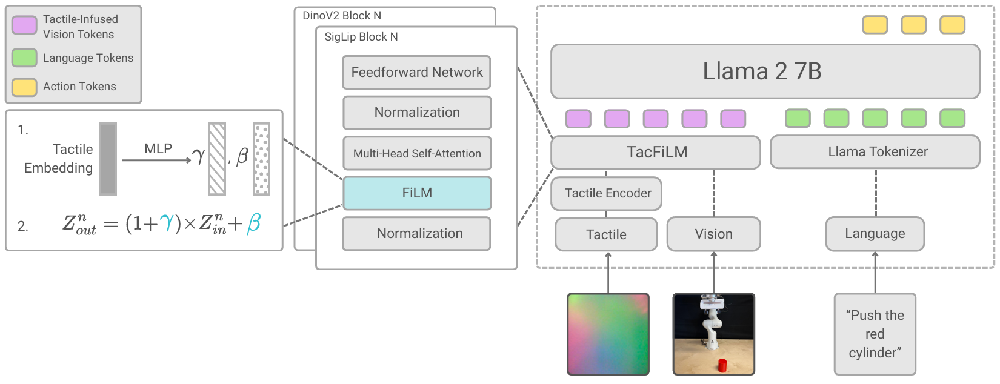
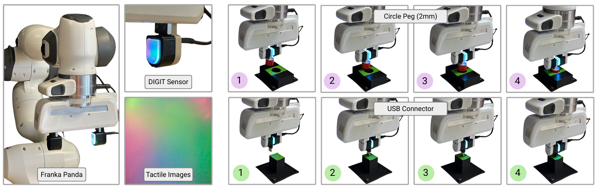

---

### Links

+ [Paper](https://arxiv.org/pdf/2603.14604)
+ [arXiv](https://arxiv.org/abs/2603.14604)

---

### A collaboration with NVIDIA Research

This work came out of a collaboration with [NVIDIA Research](https://research.nvidia.com/), bringing together robotics and perception expertise from both sides. Special thanks to Jonathan Tremblay for making the collaboration possible.

### The problem with vision-only manipulation

VLA models are impressive. Give a robot a camera and a language model and it can follow instructions, pick up objects, and generalize across scenes. But vision has a real limitation: it cannot feel. Whether a peg is fully seated, how much friction a surface has, whether the robot is actually making contact or just hovering close to it, none of that comes through in an image. For tasks that require precise contact, this matters a lot.

Adding a tactile sensor is the natural response. The tricky part is doing it in a way that actually helps rather than just adding noise or compute.



*Beautiful figures, aren't they?*

### TacFiLM

We introduce **TacFiLM**, which fuses tactile information into an existing VLA using **feature-wise linear modulation (FiLM)**. Rather than concatenating tactile tokens into the sequence alongside vision and language (which gets expensive and cluttered), the tactile encoder produces scaling and shift parameters that directly condition the visual features. The model learns to reinterpret what it sees based on what it feels.

We build on **OpenVLA** as the base vision-language-action model, and experiment with pretrained tactile encoders including **T3** and **Sparsh**, both trained on large tactile datasets and ready to plug in without retraining from scratch.



This keeps things lightweight: no big changes to the base model, no explosion in token count, and the tactile signal integrates naturally rather than competing for attention with vision and language.

### Results

We run experiments on insertion tasks using a **Franka Panda** with a **DIGIT tactile sensor**. Insertion is a good test because the margins are tight and vision alone often cannot tell you if things are going well until they are already going wrong.



TacFiLM improves success rates and force stability across scenarios. The difference is sharpest in the tightest-tolerance cases, which is exactly where you would want it.

### Citation

```latex
@article{morissette2026tactile,
  title={Tactile Modality Fusion for Vision-Language-Action Models},
  author={Morissette, Charlotte and Abyaneh, Amin and Chang, Wei-Di and Houssaini, Anas and Meger, David and Lin, Hsiu-Chin and Tremblay, Jonathan and Dudek, Gregory},
  journal={arXiv preprint arXiv:2603.14604},
  year={2026}
}
```
