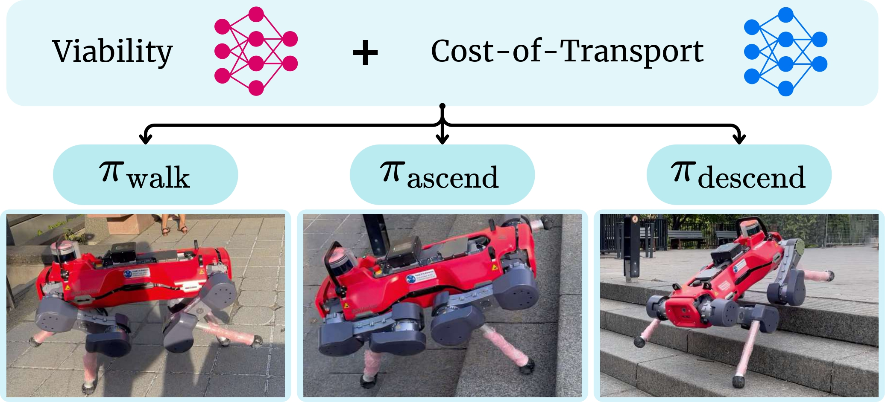
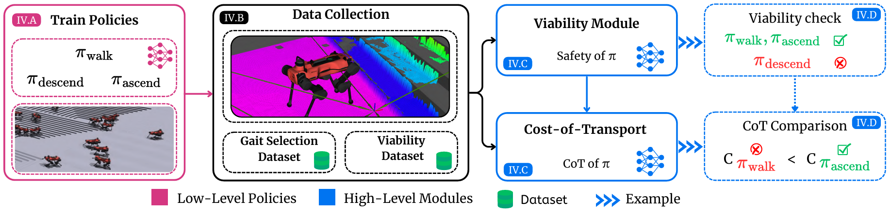
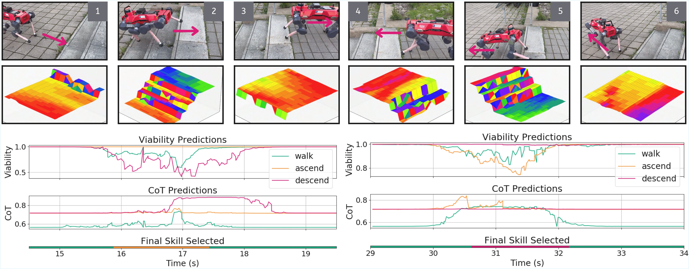

---

### Links

+ [Paper](https://arxiv.org/pdf/2510.23997)
+ [Project page](https://sites.google.com/view/vocaloco)

---

### The problem with end-to-end locomotion

Most legged locomotion approaches train a single end-to-end deep RL policy to handle everything. That works fine in familiar terrain, but when a staircase shows up, or the surface changes, the policy has no way to know it's struggling. There is no fallback, and safety and efficiency both take a hit.

<div style="display: flex; justify-content: center; margin: 24px 0;">
  
</div>

### What VOCALoco does

VOCALoco takes a modular approach. Rather than one policy doing everything, the robot has a **repertoire of locomotion skills** (walking, stair climbing, and more) and learns a selector that picks the best one given the terrain ahead. New skills can also be added to this repertoire over time, for example jumping, without retraining the others. From a local heightmap, the selector jointly predicts:

- **Viability:** will this skill execute safely on the terrain ahead?
- **Cost of transport:** how energy-efficient will it be?

The robot then picks whichever skill scores best on both, adapting as the terrain changes.



### Experiments

We evaluate on staircase locomotion tasks in both simulation and on a real quadrupedal robot. VOCALoco is more robust and safer during stair ascent and descent compared to a conventional end-to-end policy, and transfers **zero-shot** to real hardware.



---

### Citation

```latex
@ARTICLE{Wu2026Vocaloco,
  author={Wu, Stanley and Danesh, Mohamad H. and Li, Simon and Yurchyk, Hanna and Abyaneh, Amin and Houssaini, Anas El and Meger, David and Lin, Hsiu-Chin},
  journal={IEEE Robotics and Automation Letters},
  title={VOCALoco: Viability-Optimized Cost-Aware Adaptive Locomotion},
  year={2026},
  volume={11},
  number={2},
  pages={1146-1153},
  doi={10.1109/LRA.2025.3632604}
}
